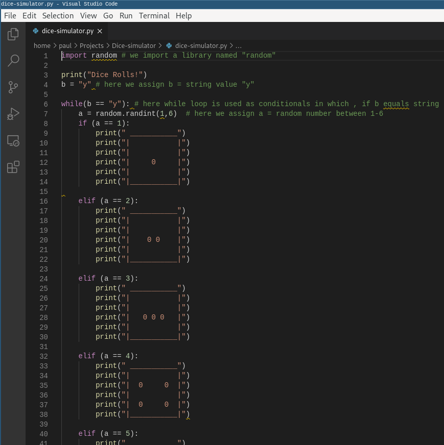
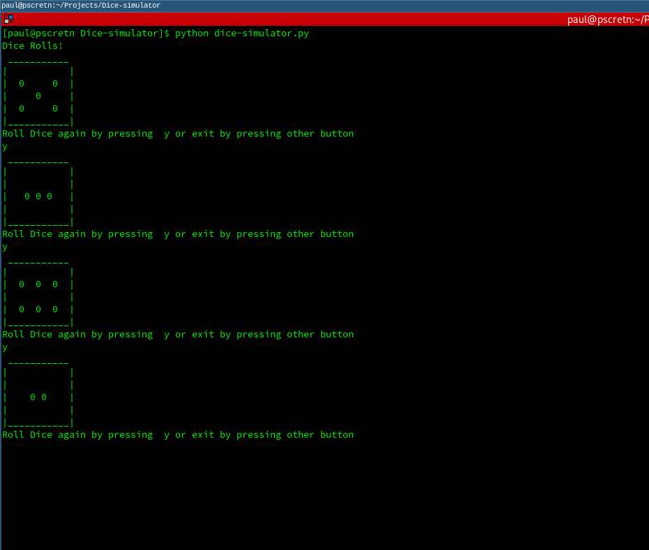

# Simple-Dice-Simulator
Dice Simulator is a program written in python , which can  be runned basically in Terminal or IDE's . In this program i had used a single library "random"
inorder to get random number for dice . <br><br>
Inorder to use library in python we use command 
```python
import random 
```
<br><br>
 <br><br>
# Program
```python
import random # we import a library named "random"

print("Dice Rolls!")
b = "y" # here we assign b = string value "y"

while(b == "y"): # here while loop is used as conditionals in which , if b equals string "y" from user  the below line will execute again   
    a = random.randint(1,6)  # here we assign a = random number between 1-6
    if (a == 1):
        print(" ___________")
        print("|           |")
        print("|           |")
        print("|     0     |")
        print("|           |")
        print("|___________|")
    
    elif (a == 2):
        print(" ___________")
        print("|           |")
        print("|           |")
        print("|    0 0    |")
        print("|           |")
        print("|___________|")

    elif (a == 3):
        print(" ___________")
        print("|           |")
        print("|           |")
        print("|   0 0 0   |")
        print("|           |")
        print("|___________|")

    elif (a == 4):
        print(" ___________")
        print("|           |")
        print("|  0     0  |")
        print("|           |")
        print("|  0     0  |")
        print("|___________|") 

    elif (a == 5):
        print(" ___________")
        print("|           |")
        print("|  0     0  |")
        print("|     0     |")
        print("|  0     0  |")
        print("|___________|")

    else:
        print(" ___________")
        print("|           |")
        print("|  0  0  0  |")
        print("|           |")
        print("|  0  0  0  |")
        print("|___________|")  

    b = input("Roll Dice again by pressing  y or exit by pressing other button\n") # this  line is used to get user input 
```
<br><br>
    
# Output
program was runned in linux terminal and the output is given below <br><br>


